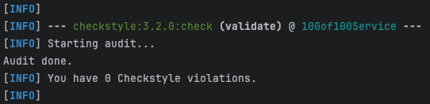
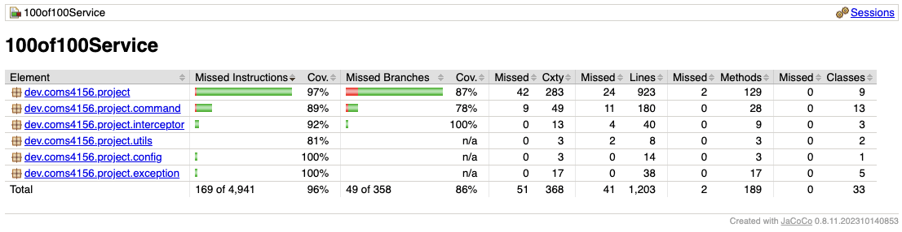

# COMS 4156 Service: 100-of-100
[](https://github.com/Alex-XJK/100-of-100-service-team/actions/workflows/maven.yml)
[](https://github.com/Alex-XJK/100-of-100-service-team/actions/workflows/github-code-scanning/codeql)

GitHub repository for service of the Team Project associated with COMS 4156 Advanced Software Engineering.
Our team name is 100-of-100 and our members are: Yifei Luo, Phoebe Wang, Jiakai Xu and Xintong Yu.

## [User] Endpoints Documentation

### GET `/getDeptInfo`
- **Expected Input Parameters**:
   - `cid` (string) - The encrypted client ID.
   - `did` (int) - The department ID.
- **Expected Output**:
   - Returns the information of the specified department.
- **Upon Success**:
   - HTTP 200 Status Code is returned with the department details in the response body.
- **Upon Failure**:
   - HTTP 404 Status Code is returned with "Department Not Found" in the response body.
   - HTTP 500 Status Code is returned with "An unexpected error has occurred" in the response body.

### GET `/getEmpInfo`
- **Expected Input Parameters**:
   - `cid` (string) - The encrypted client ID.
   - `eid` (int) - The employee ID.
- **Expected Output**:
   - Returns the information of the specified employee.
- **Upon Success**:
   - HTTP 200 Status Code is returned with the employee details in the response body.
- **Upon Failure**:
   - HTTP 404 Status Code is returned with "Employee Not Found" in the response body.
   - HTTP 500 Status Code is returned with "An unexpected error has occurred" in the response body.

### GET `/getOrgInfo`
- **Expected Input Parameters**:
   - `cid` (string) - The encrypted client ID.
- **Expected Output**:
   - Returns the information of the organization associated with the client.
- **Upon Success**:
   - HTTP 200 Status Code is returned with the organization details in the response body.
- **Upon Failure**:
   - HTTP 404 Status Code is returned with "Organization Not Found" in the response body.
   - HTTP 500 Status Code is returned with "An unexpected error has occurred" in the response body.

### GET `/statDeptBudget`
- **Expected Input Parameters**:
   - `cid` (string) - The encrypted client ID.
   - `did` (int) - The department ID.
- **Expected Output**:
   - Returns the budget (employees' salary) statistics of the specified department.
   - Sample output:
      ```json
      {
         "Total": 100000,
         "Average": 25000.07,
         "Highest": 30000.5,
         "HighestEmployee": 2,
         "Lowest": 10000.3,
         "LowestEmployee": 4
      }
      ```
- **Upon Success**:
   - HTTP 200 Status Code is returned with the budget statistics in the response body.
- **Upon Failure**:
   - HTTP 404 Status Code is returned with "Department Not Found" in the response body.
   - HTTP 500 Status Code is returned with "An unexpected error has occurred" in the response body.

### GET `/statDeptPerf`
- **Expected Input Parameters**:
   - `cid` (string) - The encrypted client ID.
   - `did` (int) - The department ID.
- **Expected Output**:
   - Returns the performance statistics of the specified department.
   - Sample output:
      ```json
      {
         "Highest": 100.0,
         "75thPercentile": 90.0,
         "Median": 80.0,
         "25thPercentile": 70.0,
         "Lowest": 0.0,
         "Average": 68.0,
         "SortedEmployeeIds": [4, 2, 3, 1]
      }
      ```
- **Upon Success**:
   - HTTP 200 Status Code is returned with the performance statistics in the response body.
- **Upon Failure**:
   - HTTP 404 Status Code is returned with "Department Not Found" in the response body.
   - HTTP 500 Status Code is returned with "An unexpected error has occurred" in the response body.

### GET `/statDeptPos`
- **Expected Input Parameters**:
   - `cid` (string) - The encrypted client ID.
   - `did` (int) - The department ID.
- **Expected Output**:
   - Returns the statistics of the positions in the specified department.
   - Sample output:
      ```json
      {
         "SoftwareEngineer": 2,
         "ProductManager": 1,
         "DataScientist": 1,
         "SalesManager": 0,
         "HumanResourceManager": 0,
         "FinancialManager": 0,
         "Other": 0
      }
      ```
- **Upon Success**:
   - HTTP 200 Status Code is returned with the statistics in the response body.
- **Upon Failure**:
   - HTTP 404 Status Code is returned with "Department Not Found" in the response body.
   - HTTP 500 Status Code is returned if any unexpected error occurs.

### PATCH `/setDeptHead`
- **Expected Input Parameters**:
   - `cid` (string) - The encrypted client ID.
   - `did` (int) - The department ID.
   - `eid` (int) - The employee ID (new head).
- **Expected Output**:
   - A success message indicating that the department head was successfully updated.
- **Upon Success**:
   - HTTP 200 Status Code is returned indicating the head of the department is set.
- **Upon Failure**:
   - HTTP 404 Status Code is returned with "Department or Employee Not Found" in the response body.
   - HTTP 500 Status Code is returned with "An unexpected error has occurred" in the response body.

### PATCH `/setEmpPerf`
- **Expected Input Parameters**:
   - `cid` (string) - The encrypted client ID.
   - `eid` (int) - The employee ID.
   - `performance` (double) - The new performance of the employee.
- **Expected Output**:
   - A success message indicating that the employee's performance was successfully updated.
- **Upon Success**:
   - HTTP 200 Status Code is returned indicating the performance of the employee is set.
- **Upon Failure**:
   - HTTP 404 Status Code is returned with "Employee Not Found" in the response body.
   - HTTP 500 Status Code is returned if any unexpected error occurs.

### PATCH `/setEmpPos`
- **Expected Input Parameters**:
   - `cid` (string) - The encrypted client ID.
   - `eid` (int) - The employee ID.
   - `position` (string) - The new position of the employee.
      - Possible values: "SoftwareEngineer", "ProductManager", "DataScientist", "SalesManager", "HumanResourceManager", "FinancialManager", "Other".
- **Expected Output**:
   - A success message indicating that the employee's position was successfully updated.
- **Upon Success**:
   - HTTP 200 Status Code is returned indicating the position of the employee is set.
- **Upon Failure**:
   - HTTP 404 Status Code is returned with "Employee Not Found" in the response body.
   - HTTP 500 Status Code is returned if any unexpected error occurs.

### PATCH `/setEmpSalary`
- **Expected Input Parameters**:
   - `cid` (string) - The encrypted client ID.
   - `eid` (int) - The employee ID.
   - `salary` (double) - The new salary of the employee.
- **Expected Output**:
   - A success message indicating that the employee's salary was successfully updated.
- **Upon Success**:
   - HTTP 200 Status Code is returned indicating the salary of the employee is set.
- **Upon Failure**:
   - HTTP 404 Status Code is returned with "Employee Not Found" in the response body.
   - HTTP 500 Status Code is returned if any unexpected error occurs.

### POST `/addEmpToDept`
- **Expected Input Parameters**:
   - `cid` (string) - The encrypted client ID.
   - `did` (int) - The department ID.
   - `name` (String) - The name of the employee.
   - `hireDate` (String) - The hire date of the employee in the format `"yyyy-MM-dd"`.
- **Expected Output**:
   - A success message indicating the employee has been added to the department.
- **Upon Success**:
   - HTTP 201 Status Code is returned with a success message.
- **Upon Failure**:
   - HTTP 404 Status Code is returned with "Department Not Found" in the response body.
   - HTTP 500 Status Code is returned with "An unexpected error has occurred" in the response body.

### DELETE `/removeEmpFromDept`
- **Expected Input Parameters**:
   - `cid` (string) - The encrypted client ID.
   - `did` (int) - The department ID.
   - `eid` (int) - The employee ID.
- **Expected Output**:
   - A success message indicating the employee has been removed from the department.
- **Upon Success**:
   - HTTP 200 Status Code is returned with a success message.
- **Upon Failure**:
   - HTTP 404 Status Code is returned with "Department or Employee Not Found" in the response body.
   - HTTP 500 Status Code is returned with "An unexpected error has occurred" in the response body.

## [Ops] Deployment instructions

### Building and Running a Local Instance
In order to build and use the service of the project, you must install the following:

1. [Maven 3.9.5](https://maven.apache.org/download.cgi) Download and follow the installation instructions. Set the bin as a new path variable for both Windows and MacOS.
2. [JDK 17](https://www.oracle.com/java/technologies/javase/jdk17-archive-downloads.html) used for development.
3. [IntelliJ IDE](https://www.jetbrains.com/idea/download/?section=windows) Or use other IDE of your preference.

In order to build the project, run under `./100of100Service` directory:
```bash
mvn -B package --file pom.xml
```
Or:
```bash
mvn clean install
```
To run the application, please use:
```bash
mvn spring-boot:run
```

## [Developer] Development Notice

### Service Design
At the beginning of the development of our services, we first carried out a careful design, in which we focus on the adoption of the following design patterns to decompose the modules, making it easier to extend and maintain the code in the future.

#### Command Pattern
Instead of directly calling the service methods from the Springboot routes, we use the command pattern to encapsulate the detailed service logic into command objects. This way, we satisfy the Single Responsibility Principle, the route handler only needs to focus on the request and response, and the command object is responsible for implementing the different service logic (Freeman 208).

#### Composite Pattern
We use the composite pattern to organize the Organization, Department, and Employee hierarchy. This way, we satisfy the Open-Closed Principle, we can traverse the organization structure uniformly, and easily add new types of entities (Freeman 364).

#### Singleton Pattern
In order to ensure that the database connection is only created once, and to improve its reliability under high concurrency, we use the singleton pattern to make sure database connection only has one instance and provide a global access point to it (Freeman 179).

#### Facade Pattern
Given the inherent complexity that comes with databases, to ensure the Law of Demeter, we use the facade pattern to encapsulate the database operations. This way, the service logic does not need to know the details of the database operations, and the database operations can be easily replaced in the test and in the future (Freeman 272).

### Running Cloud Service

To reach our service using cloud computing, please follow the steps below:
1. When running tests in Postman point them to: https://coms-4156-team-project.ue.r.appspot.com/
2. If the home/index page displays "Welcome, in order to make an API call direct your browser or Postman to an endpoint," then the service is operational and connection is successful.
3. Test the endpoints by passing the endpoint name and parameters via Postman or some other tools. For example: https://coms-4156-team-project.ue.r.appspot.com/getEmpInfo?cid=MQ&eid=2

### Running Test Suite
Our unit tests are located under directory `src/test`. After setting up and building the project, run
```bash
mvn test
```
You may also run the tests by right click any class in src/test directory and run to see the results if you are using IntelliJ IDEA as IDE.

### Style Checking Report
In order to make sure the code is following the style guide, we use Maven Checkstyle plugin. To run the checkstyle report, run the following command:
```bash
mvn checkstyle:check
```
One of the latest checkstyle report is located at `./checkstyle.out` file.


### Branch Coverage Report
We use JaCoCo Maven plugin to generate the branch coverage report. To generate the report, first make sure you have run the test suite. Then run the following command:
```bash
mvn jacoco:report
```
The report is located at `./target/site/jacoco/index.html` file.

Currently, the branch coverage is at 64% for the service.


### Tool Used
Maven, JUnit, JaCoCo, Maven Checkstyle, AWS RDS, DataGrip

## [Team] Teamwork and Collaboration

### Project Management
We use [GitHub Projects](https://github.com/users/Alex-XJK/projects/2) to manage our tasks and progress.
In the GitHub Projects, we use Kanban board to manage our tasks. We have columns for To Do, In Progress, and Done to keep track of the progress of each task. We also use the GitHub Issues to create tasks and assign them to team members. We use the GitHub Pull Requests to review the code and merge the code into the main branch.

### PR Review Process
We enforce the PR review process to ensure the quality of the code.
All changes in the main branch must be made through a pull request. The pull request must be reviewed by at least one team member and make sure all the discussions are resolved before merging.

### Division of Work
Although the GitHub Projects documents all the tasks done or led by each team member, as per the assignment requirements, we also briefly summarize the general division of work here (please refer to the GitHub Projects for more details):

- **Yifei Luo**: Responsible for the database design, implementation, and its deployment.
- **Phoebe Wang**: Responsible for the API design, service implementation, testing, and external documentation.
- **Jiakai Xu**: Responsible for the initial project setup, overall architecture design and implementation, and the internal documentation.
- **Xintong Yu**: Responsible for the interface integration between service and database.

(names are in alphabetical order)

---
Works Cited:
- Freeman, Eric, et al. *Head First Design Patterns*. O’Reilly, 2014.
